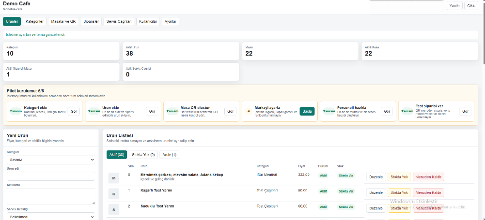
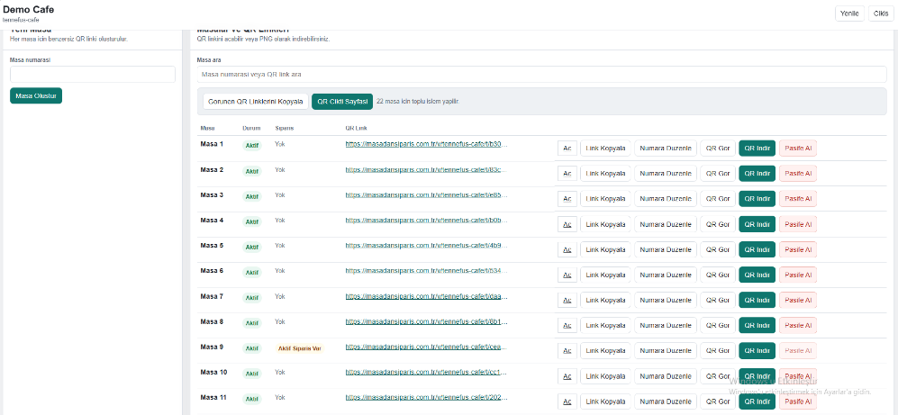
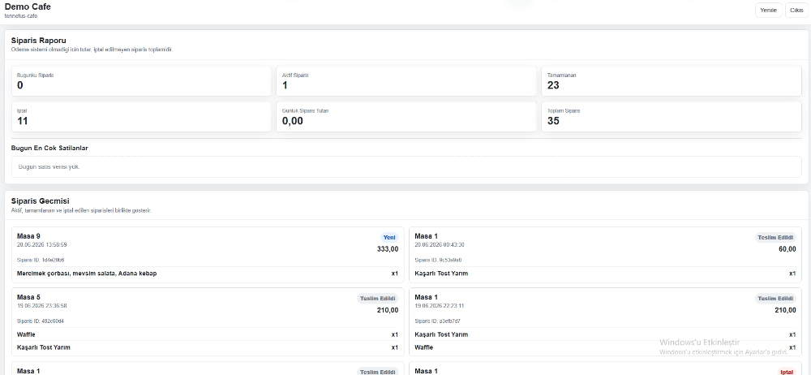
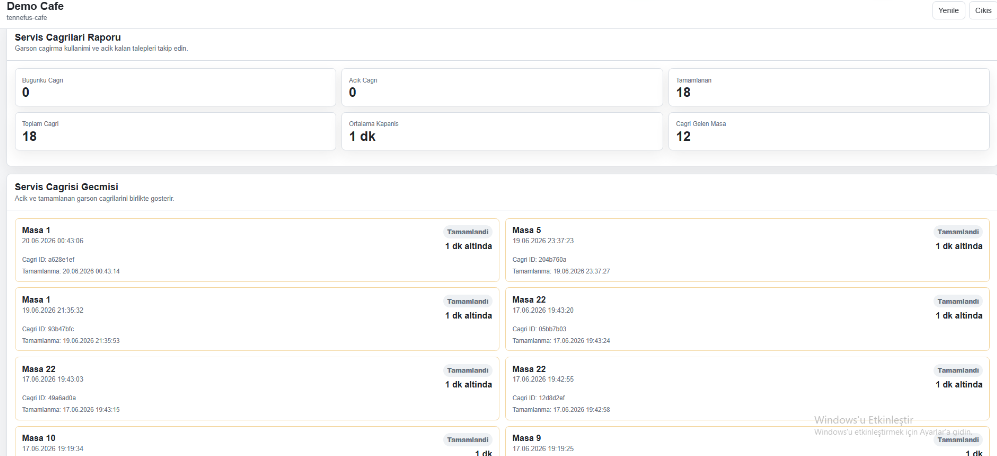
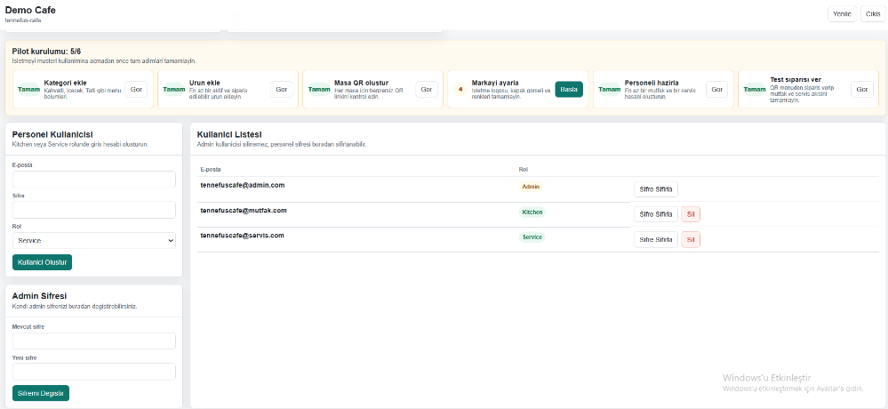

#  QrOrder

# Çok İşletmeli QR Restoran Sipariş Sistemi

ASP.NET Core ile geliştirilmiş, restoran ve kafelerin QR kod üzerinden sipariş almasını sağlayan çok işletmeli (Multi-Tenant) restoran otomasyon sistemidir.

Bu proje tek bir uygulama üzerinden birden fazla işletmenin bağımsız olarak yönetilebilmesine olanak sağlar.

> ⚠️ Bu proje ticari olarak geliştirilmektedir. Kaynak kodu bu nedenle herkese açık olarak paylaşılmamaktadır.

---

#  Özellikler

-  Multi-Tenant SaaS altyapısı
-  QR Menü ve masadan sipariş
-  Gerçek Zamanlı Sipariş Yönetimi (SignalR)
-  Mutfak Paneli
-  Servis Paneli
-  İşletme Yönetim Paneli
-  Super Admin Paneli
-  JWT Kimlik Doğrulama
-  Rol Bazlı Yetkilendirme
-  Ürün ve Kategori Yönetimi
-  Sipariş Takibi
-  Mobil Uyumlu Tasarım
-  Rate Limiting & Serilog
-  MSSQL + Entity Framework Core
-  HTML
-  CSS
-  JavaScript
-  Bootstrap
-  Health Checks
-  Backup / Restore
-  N-Tier Architecture
-  k6 Load Test

#  Müşteri

- QR ile menüye erişim
- Sepet
- Sipariş oluşturma
- Sipariş durumu takibi

#  Mutfak

- Yeni siparişleri anlık görüntüleme
- Hazırlanıyor
- Hazır
- SignalR ile servis ekranına aktarım

#  Servis

- Hazır siparişler
- Garson çağrıları
- Teslim süreci

#  İşletme Admini

- Dashboard
- Ürün yönetimi
- Kategori yönetimi
- Masa yönetimi
- QR oluşturma
- Personel yönetimi
- İşletme ayarları
- Satış raporları
- Menüden Sipariş alımını açıp kapatma

#  Super Admin

- Tenant oluşturma
- İşletme yönetimi
- Kullanıcı yönetimi
- Merkezi raporlama

---

# 📖 Sistem Nasıl Çalışıyor?

1. Müşteri masadaki QR kodu okutur.
2. Menü açılır ve sipariş oluşturulur.
3. Sipariş veritabanına kaydedilir.
4. SignalR ile sipariş anlık olarak mutfak ekranına iletilir.
5. Mutfak siparişi hazırladıktan sonra "Hazır" durumuna geçirir.
6. SignalR ile sipariş servis ekranına aktarılır.
7. SignalR bağlantısı kesilse bile siparişler veritabanında tutulduğu için bağlantı tekrar kurulduğunda sistem kaldığı yerden devam eder.

# 📸 Ekran Görüntüleri

## Menü

---

## Menü

---

## Sepet

---

## Mutfak Giriş Ekranı

---

## Mutfak Paneli

---

## Servis Giriş Ekranı

---

## Servis Paneli

---

## İşletme Admin Girişi

---

## İşletme Yönetim Paneli

---

## Super Admin Giriş

---

## Super Admin Paneli

---

# 🔒 Kaynak Kodu

Bu proje aktif olarak geliştirilen ticari bir projedir.

Kaynak kodu herkese açık olarak paylaşılmamaktadır.

Vds ile test edilmiştir
