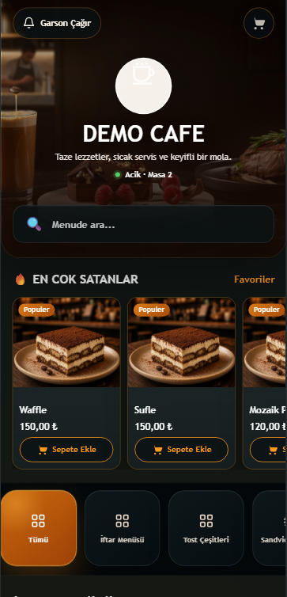
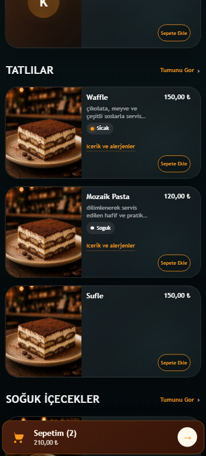
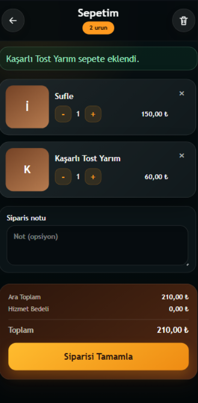
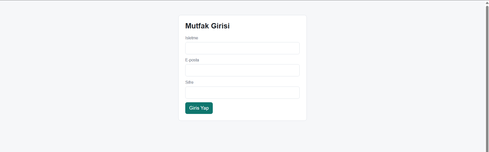
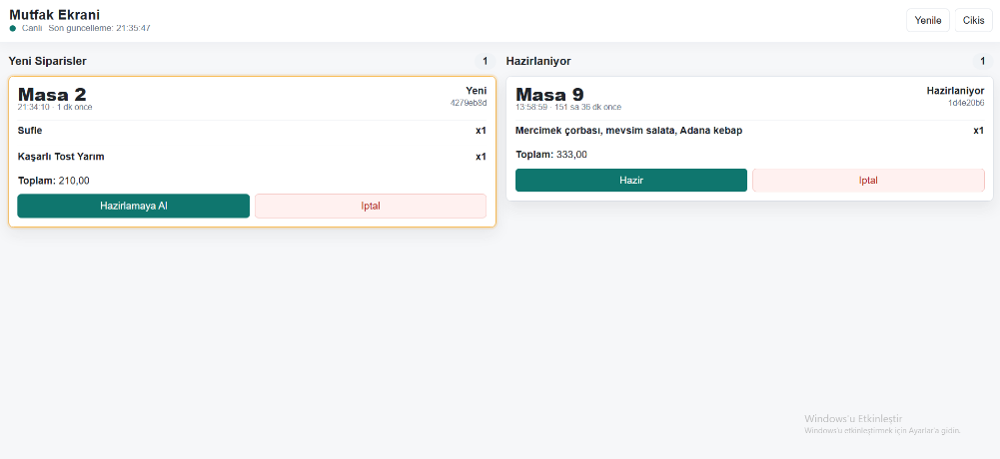
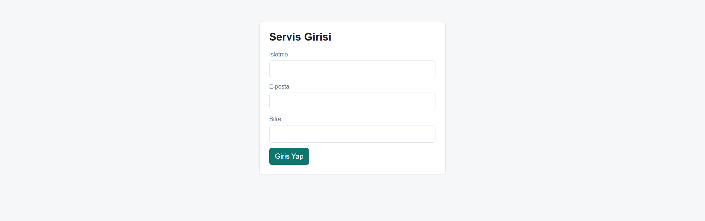
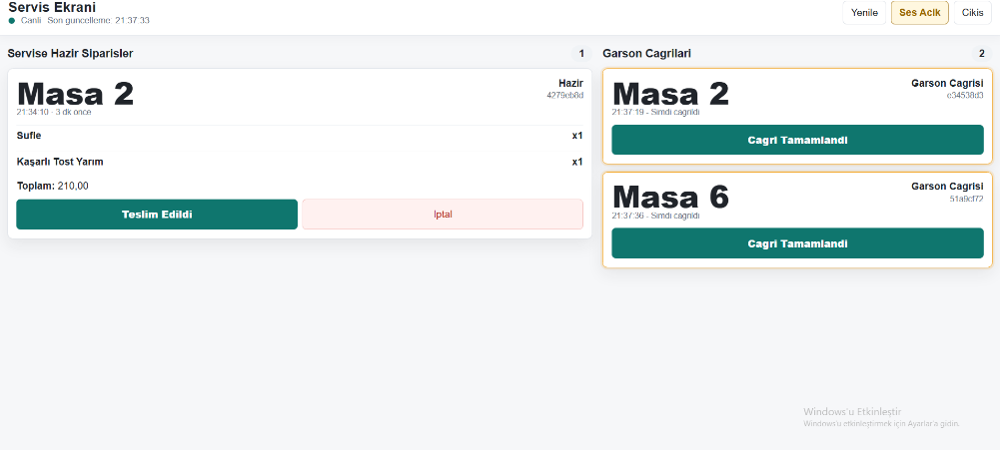
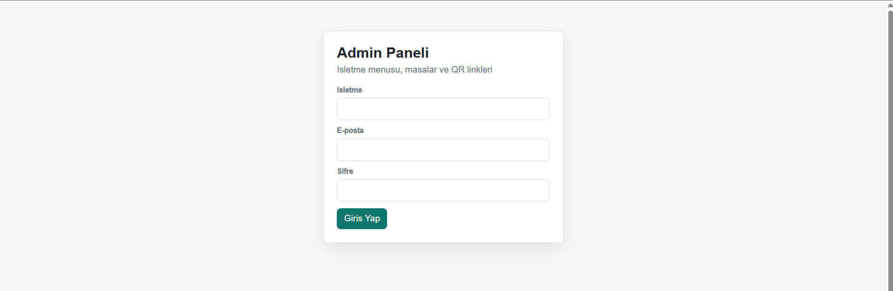
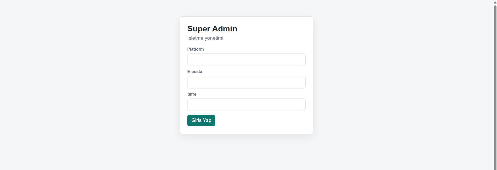
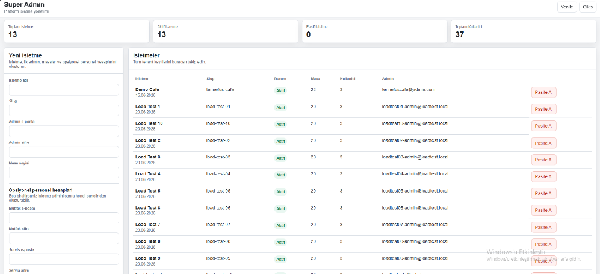

# 🍽️ QrOrder

# Çok İşletmeli QR Restoran Sipariş Sistemi

ASP.NET Core ile geliştirilmiş, restoran ve kafelerin QR kod üzerinden sipariş almasını sağlayan çok işletmeli (Multi-Tenant) restoran otomasyon sistemidir.

Bu proje tek bir uygulama üzerinden birden fazla işletmenin bağımsız olarak yönetilebilmesine olanak sağlar.

> ⚠️ Bu proje ticari olarak geliştirilmektedir. Kaynak kodu bu nedenle herkese açık olarak paylaşılmamaktadır.

---

# 🚀 Başlıca Özellikler

- ✅ Çok İşletmeli (Multi-Tenant) Mimari
- ✅ QR Menü Sistemi
- ✅ Gerçek Zamanlı Sipariş Yönetimi (SignalR)
- ✅ Mutfak Paneli
- ✅ Servis Paneli
- ✅ İşletme Yönetim Paneli
- ✅ Super Admin Paneli
- ✅ JWT Kimlik Doğrulama
- ✅ Rol Bazlı Yetkilendirme
- ✅ Ürün ve Kategori Yönetimi
- ✅ Sipariş Takibi
- ✅ Mobil Uyumlu Tasarım

---

# 🛠 Kullanılan Teknolojiler

- ASP.NET Core MVC
- C#
- Entity Framework Core
- SQL Server
- SignalR
- JWT Authentication
- Bootstrap
- HTML
- CSS
- JavaScript

---

# 📖 Sistem Nasıl Çalışıyor?

1. Müşteri masadaki QR kodu okutur.
2. Menü açılır ve sipariş oluşturulur.
3. Sipariş veritabanına kaydedilir.
4. SignalR ile sipariş anlık olarak mutfak ekranına iletilir.
5. Mutfak siparişi hazırladıktan sonra "Hazır" durumuna geçirir.
6. SignalR ile sipariş servis ekranına aktarılır.
7. SignalR bağlantısı kesilse bile siparişler veritabanında tutulduğu için bağlantı tekrar kurulduğunda sistem kaldığı yerden devam eder.

---

# 📸 Ekran Görüntüleri

## Ana Menü

---

## Menü (Alternatif Görünüm)

---

## Sepet

---

## Mutfak Giriş Ekranı

---

## Mutfak Paneli

---

## Servis Giriş Ekranı

---

## Servis Paneli

---

## İşletme Admin Girişi

---

## İşletme Yönetim Paneli

---

## Super Admin Giriş

---

## Super Admin Paneli

---

# 💡 Teknik Özellikler

- ASP.NET Core MVC
- Entity Framework Core
- SQL Server
- SignalR
- JWT Authentication
- Multi-Tenant Mimari
- Responsive Tasarım

---

# 🔒 Kaynak Kodu

Bu proje aktif olarak geliştirilen ticari bir projedir.

Kaynak kodu herkese açık olarak paylaşılmamaktadır.

Vds ile test edilmiştir
